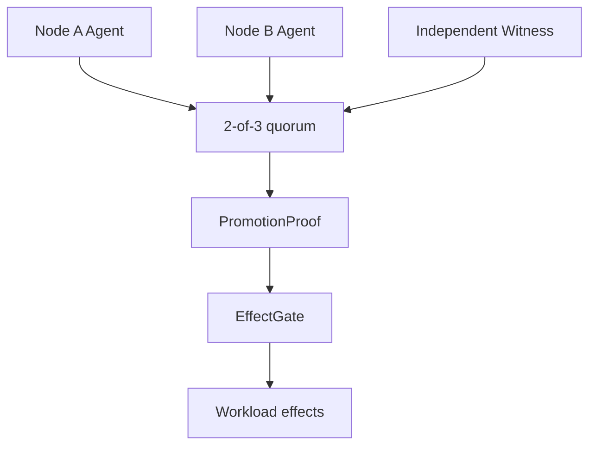

# QuorumArc

QuorumArc is a **proof-carrying continuity fabric** for safe, low-downtime
failover. It starts from a strict rule: a node cannot become externally active
because it merely believes the peer is dead. It must first present a verifiable
`PromotionProof` containing quorum, fencing, durable-state, health, lease, and
policy evidence.

> Status: Gate 0 research prototype. Automatic production failover is not yet
> enabled or claimed.

## What is different

- **PromotionProof** — promotion is an evidence bundle, not a Boolean decision.
- **EffectGate** — stale or uncertified nodes cannot emit network, storage, or
  device side effects.
- **Continuity Capsule** — each workload declares its state, external effects,
  recovery method, and promised continuity level.
- **Continuity Receipt** — every activation records the evidence that made it
  safe and can be replayed in the deterministic simulator.
- **Progress lease** — future lease renewal will depend on durable application
  progress, not heartbeat traffic alone.



## Safety invariants

1. At most one node may hold externally effective authority for a workload.
2. Every acknowledged RPO-0 write must be recoverable after any single fault.
3. Lower-epoch commands and side effects must be rejected at every boundary.
4. No promotion may occur before verified fencing or provable gate expiry.
5. Missing or ambiguous evidence closes the gate; it never fails open.

See [the safety model](docs/SAFETY.md), [architecture](docs/ARCHITECTURE.md),
and [targets](docs/TARGETS.md).

## Workspace

| Package | Purpose |
|---|---|
| `quorumarc-core` | Pure Rust proof validator and fail-closed EffectGate |
| `quorumarc-sim` | Deterministic compact-model fault-schedule explorer |
| `quorumarc-agent` | Safe-default node-agent shell; cannot promote yet |
| `quorumarc-witness` | Safe-default witness shell; cannot issue votes yet |

The Gate 0 core has no third-party runtime dependencies, which keeps the safety
surface small and supports offline review.

The current simulator reuses the real proof validator and gate transitions, but
still has one serial metadata view and one trusted clock. It is not yet a proof
for concurrent certificates, delayed messages, witness double-voting, or clock
stall/skew. See [simulation scope](docs/SIMULATION.md).

## R8 boundary

The existing R8 Protocol repository remains unchanged. R8 may later be pinned
to an exact reviewed commit as an optional, dual-path data transport adapter.
It is **not** quorum, consensus, fencing, durable replication, or authority.
See [R8 boundary](docs/R8_BOUNDARY.md).

## Build and test

```bash
cargo fmt --all -- --check
cargo clippy --workspace --all-targets --all-features -- -D warnings
cargo test --workspace --all-targets
cargo run -p quorumarc-sim -- --depth 10
```

## Development gates

- **Gate 0:** safety model, proof validator, simulator; no automatic failover.
- **Gate 1:** two Linux nodes + independent witness, systemd/container service,
  real fencing, VIP activation, signed receipts.
- **Gate 2:** synchronous durable WAL and explicit RPO-0 service profiles.
- **Gate 3:** KVM warm-standby adapters for Linux and Windows guests.
- **Gate 4:** workload-specific hot shadow and session continuity.

This public repository exposes the Gate 0 research prototype for review and
reproducible verification. The code remains proprietary under `LICENSE`; public
visibility does not grant production-use or redistribution rights. The name has
only undergone a preliminary collision scan, so formal trademark clearance is
still required before commercial release.
