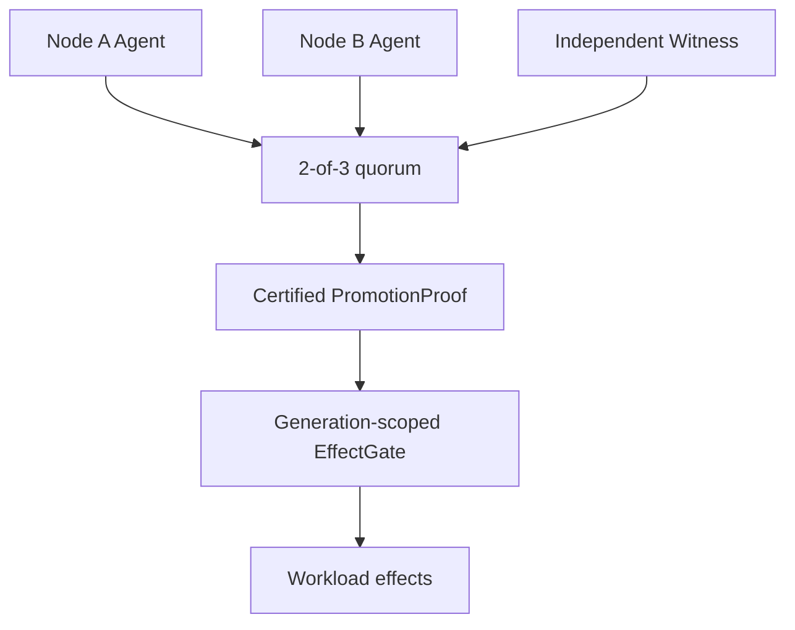

# QuorumArc

[](https://github.com/happyaspic-byte/quorumarc/actions/workflows/ci.yml)

QuorumArc is a **proof-carrying continuity fabric** research project for safe,
low-downtime failover. A node cannot become externally active merely because
it believes its peer is dead. It must present verifiable authority evidence for
quorum, fencing or safe lease expiry, durable state, health, time, and policy.

> Status: **Gate 1A foundation under development.** The repository contains
> tested protocol, storage, runtime, RPO-0 demonstration, and process-lab
> components, but it does not yet implement automatic Node A/Node B failover or
> a production EffectGate. Production readiness, zero downtime, and completed
> physical validation are not claimed.

## Core ideas

- **PromotionProof** — promotion is an evidence bundle, not a Boolean decision.
- **EffectGate** — stale or uncertified generations cannot emit external effects.
- **Continuity Capsule** — each workload declares state, effects, recovery, and
  its promised continuity level.
- **Continuity Receipt** — activation records the evidence that made it safe.
- **Progress lease** — renewal must depend on durable application progress, not
  heartbeat traffic alone.

The target authority flow below is architectural intent; the arrows are **not**
a claim that the complete flow is currently connected.



## Safety invariants

1. At most one node may hold externally effective authority for a workload.
2. Every acknowledged demonstration RPO-0 write must survive one data-node loss.
3. Lower-epoch commands and side effects must be rejected at every boundary.
4. No promotion may occur before verified fencing or conservative gate expiry.
5. Missing or ambiguous evidence closes the gate; it never fails open.

These invariants are currently checked within the scopes of individual
components and the compact model. They have not yet been demonstrated by one
end-to-end Node A/Node B/Witness activation and failover campaign. See the
[safety model](docs/SAFETY.md), [Gate 1A scope](docs/GATE1A.md), and
[failure matrix](docs/FAILURE_MATRIX.md).

## Workspace

| Package | Implemented purpose | Current claim boundary |
|---|---|---|
| `quorumarc-core` | Promotion-proof validation and logical fail-closed EffectGate | In-memory safety kernel |
| `quorumarc-sim` | Deterministic compact-model schedule explorer | One serial metadata view and trusted logical clock |
| `quorumarc-wire` | Strict canonical envelope and domain-separated Ed25519 verification | Component protocol; not a complete authority transaction |
| `quorumarc-store` | Checksummed atomic authority journal with fault injection | File-store model; not proof for every disk/filesystem |
| `quorumarc-runtime` | Bounded frames, durable Witness actor, and test EffectGate sink | Component runtime only |
| `quorumarc-rpo0` | Two-replica WAL-backed monotonic-counter demonstration | Demonstration workload, not a general database |
| `quorumarc-lab` | Real localhost TCP Witness process and deterministic fault cases | No complete Node A/Node B active-writer lifecycle |
| `quorumarc-cluster` | Same-binary peer/Witness/bootstrap modes for one explicit lab genesis | Bounded one-shot lab only; no failover/failback or production authority claim |
| `quorumarc-agent` | Safe-default inspection/refusal CLI | Automatic promotion deliberately disabled |
| `quorumarc-witness` | Safe-default Witness inspection/refusal CLI | No production network voting service |

## Implementation and validation status

| Classification | Current status |
|---|---|
| Implemented in source | Canonical signed wire format, durable authority store, Witness actor/process lab, RPO-0 demo, logical/test EffectGate, safe-default CLIs, and a bounded three-process one-shot genesis lab |
| Historical linked compact model | Extended Safety run #6 on `0424290` explored depth 12: 143,439 unique states, 836,424 transitions, and 0 model invariant violations; the Draft PR is authoritative for its exact head |
| Partially verified on GitHub-hosted Ubuntu | Component tests, a Witness child process over localhost TCP, bounded/malformed input handling, idempotent voting, and declared store crash points |
| Not yet end-to-end verified | Long-running Node A/B election, Active failure recovery, real failover/failback, repeated authority transfer, and all 25 scenarios as global PASS results |
| Requires physical equipment | Independent failure domains, real NIC/switch faults, BMC/PDU or storage fencing, VIP movement, hardware clock behavior, and client-observed outage |

As a historical baseline, Extended Safety run #6 on commit `0424290` executed
**153 tests: 153 passed, 0
failed, 0 ignored**. It also completed 16 real-process Witness-lab repetitions,
16 durable-store crash-recovery repetitions, and all seven named malformed
parser checks. This is component/process evidence, not a global PASS for the 25
integrated failover scenarios.

That historical run measured **76.05% workspace line coverage** and did not meet
the 80% target. Exact-head coverage is reported only from the Draft PR's linked
artifact; no threshold is weakened or silently treated as passing. The linked
run's model counts apply only
to its exact compact-model revision and do not prove physical or end-to-end HA.

## Build and test

```bash
cargo fmt --all -- --check
cargo clippy --locked --workspace --all-targets --all-features -- -D warnings
cargo test --locked --workspace --all-targets
cargo run --locked -p quorumarc-sim -- --depth 12 --require-safe
```

The bounded release binary also provides a one-command Ubuntu self-test. It
starts candidate, peer, and Witness roles, verifies the exact durable one-shot
result, and cleans its deterministic test fixture:

```bash
cargo build --locked --release -p quorumarc-cluster
./target/release/quorumarc-cluster self-test --allow-lab-genesis
```

See the [Gate 1A quick start](docs/QUICKSTART.md). This convenience does not add
automatic failover or change the lab-only claim boundary. The competitive
product acceptance program is tracked separately in
[product completeness](docs/PRODUCT_COMPLETENESS.md).

Do not infer a completed Gate 1A result from a local run or from the CI badge.
An exit claim requires the exact commit, successful workflow URL, artifact, test
inventory, model report, coverage report, and scenario-by-scenario evidence.

## Primary unresolved blocker

The bounded lab adds an explicitly enabled `LAB_GENESIS_ONE_SHOT` path
that joins a candidate, one durable peer, and a Witness to one signed envelope
and one test-sink effect. It deliberately uses fixed fixture time/fencing and
does not implement Active failure, authority transfer, lease renewal, failover,
or failback. The normal agent still reports
`ACTIVATION_CONTROL_PLANE_UNAVAILABLE` and remains closed.

External uniqueness and enforcement remain decisive blockers. If every trusted
store and a Witness credential are cloned into an independent instance, the
copies are indistinguishable. A global single-writer claim still requires
protected Witness ownership, identity-bound stores, trusted time or real
fencing, and an enforced EffectGate. See
[known limitations](docs/KNOWN_LIMITATIONS.md).

## R8 boundary

The existing R8 Protocol repository remains unchanged. R8 may later be pinned
to an exact reviewed commit as an optional data-transport adapter. It is **not**
quorum, consensus, fencing, durable replication, or authority. See the
[R8 boundary](docs/R8_BOUNDARY.md).

## Delivery gates

- **Gate 0:** compact safety model and proof validator.
- **Gate 1A:** GitHub-hosted authority lab; current foundation is incomplete.
- **Gate 1 physical:** two Linux data hosts, an independent Witness, and real
  endpoint/fence adapters.
- **Later gates:** supported workload profiles, KVM adapters, and hot shadows.

The repository is public for review and reproducible research, but the code
remains proprietary under `LICENSE`; public visibility does not grant
production-use or redistribution rights. Formal trademark clearance is also
required before commercial release.
