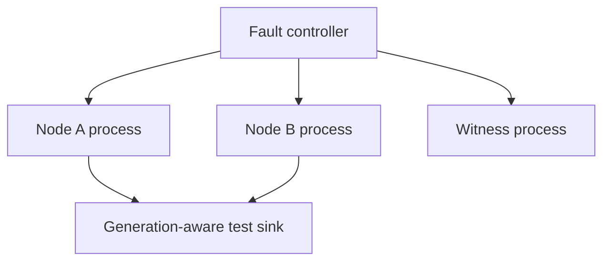
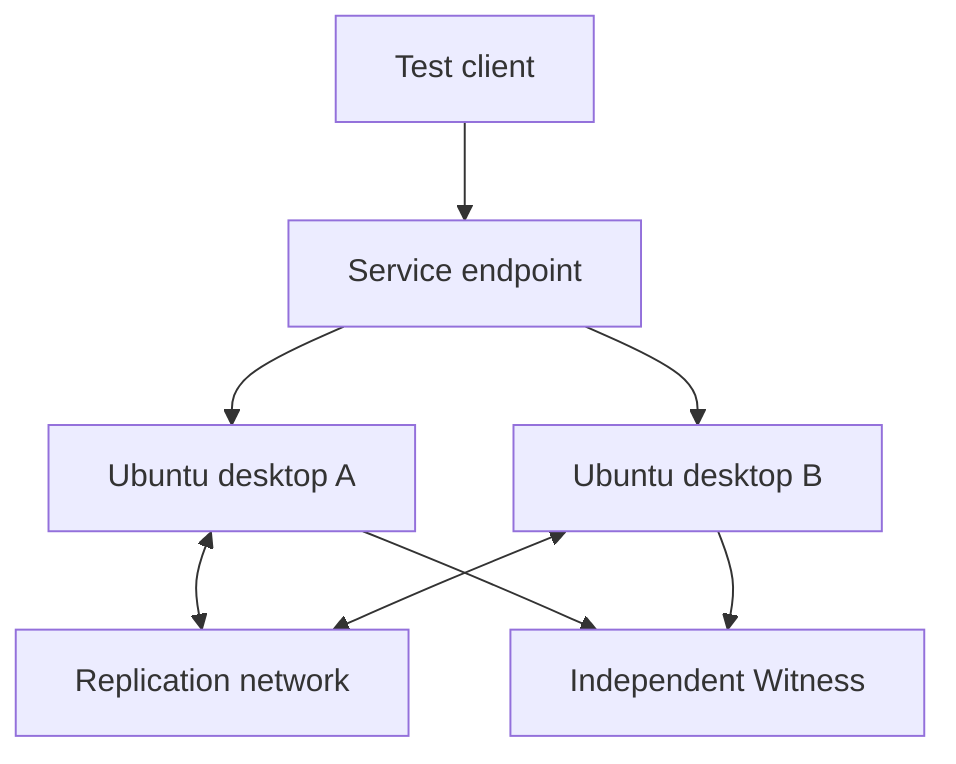

# Lab setup

## Two distinct labs

QuorumArc uses two deliberately separate validation environments:

1. **GitHub-hosted Gate 1A lab:** three processes on one disposable Ubuntu
   runner. This is the first target and needs no user-owned PCs.
2. **Future physical lab:** two ordinary Ubuntu desktop PCs plus an independently
   placed Witness. This is required for real power, NIC, switch, endpoint, clock,
   and fencing evidence.

Passing the first lab does not imply that the second has passed.

## GitHub-hosted Gate 1A topology

The intended workflow starts one binary as Node A, the same binary as Node B,
and a witness-only binary. Each receives a unique loopback address or port,
configuration file, identity, test key, and durable directory. A deterministic
user-space fault proxy is preferred when privileged namespaces are unreliable on
hosted runners.

The workflow must:

- use non-production test identities generated or installed for the job;
- keep A, B, and Witness stores in separate directories;
- wait for explicit health readiness instead of fixed sleep assumptions;
- inject faults by scenario and retain a seed/trace;
- assert the generation-aware sink sees at most one valid writer;
- restart processes against the same role-specific durable directory;
- upload failure traces without private keys or credentials;
- tear down all children even after a failed assertion.

This arrangement can validate network protocol and local persistence behavior.
It cannot validate host independence because every process shares the runner's
kernel, clock, storage stack, hypervisor, and power.

## Future physical topology

Ordinary desktop hardware is sufficient for a development lab. GPU capability
is irrelevant. A practical starting point is:

| Role | Minimum development configuration | Notes |
|---|---|---|
| Node A | 4 CPU cores, 8 GiB RAM, 100 GiB SSD, Ubuntu Server, wired Ethernet | A second NIC is strongly preferred for a separate replication path |
| Node B | Same class as A | Use a separate physical PC and power connection |
| Witness | 1-2 cores, 1-2 GiB RAM, small durable disk, Ubuntu or supported container host | Mini PC, Raspberry Pi-class device, NAS VM/container, or isolated VM; must not run on A or B for independence claims |

Suggested logical networks are management, replication, and service. They may
share a switch in an initial functional lab, but a shared switch is then a
documented common failure domain. Production-oriented testing should introduce
independent switch/power paths and explicitly map every external effect.

### Desktop fencing limitation

Most ordinary desktop PCs have no BMC/Redfish/IPMI controller. A stopped process,
SSH command, or missing heartbeat is not authoritative fencing. Early desktop
tests must therefore use a conservatively expired EffectGate lease and manual
fault injection, or a controlled smart PDU with reliable power-state read-back.
Those tests remain development evidence. Server-grade production fencing claims
require supported BMC/PDU/storage/network adapters and negative testing.

## Physical-lab preparation checklist

- Install the same supported Ubuntu Server and QuorumArc build on both nodes.
- Configure stable node identities; never clone a durable incarnation directory.
- Synchronize time for observability, while keeping lease safety dependent on
  the documented monotonic-clock assumptions rather than NTP correctness alone.
- Give each role its own signing key and least-privilege service account.
- Keep private keys out of shell history, Git, and shared test artifacts.
- Disable automatic promotion initially and validate configuration/status first.
- Map workload state and every network, storage, serial, USB, PLC, and other
  output before declaring the workload eligible.
- Establish a separate test client that continuously records success, latency,
  duplicates, gaps, endpoint generation, and acknowledged operation IDs.
- Capture switch, PDU/BMC, node, witness, and client clocks/logs for correlation.
- Back up test configuration and authority records before destructive drills.

## Suggested physical test order

1. Configuration and identity validation with every EffectGate closed.
2. Manual planned switchover using the test workload.
3. Agent and workload process crash/restart.
4. Witness loss and each single network-path loss.
5. Replication lag and RPO-0 write refusal.
6. Old-state/replay fixtures with automatic promotion disabled.
7. Lease-expiry test with conservative timing and client observation.
8. Supported PDU/BMC/storage fence test, including wrong-target prevention and
   state read-back.
9. Full PC power loss, switch/cable faults, and repeated failover/failback.
10. Long-running load, repair, upgrade, rollback, and key-rotation campaigns.

Every phase begins fail-closed and advances only after the previous evidence is
reviewed. Do not introduce a protected production workload into this lab.

## Public self-hosted-runner warning

**Do not connect either desktop or the Witness as a permanent self-hosted runner
to the public `quorumarc` repository.** Public pull requests and dependency code
are untrusted. A workflow can persist on a self-hosted machine, steal runner or
lab credentials, and pivot into the management network.

If remote hardware automation is later required, use a separate private
`lab-control` repository or equivalent access-controlled system. It should have:

- no workflows triggered directly by untrusted forks;
- isolated lab VLANs and accounts with no production-network reachability;
- narrowly scoped, short-lived credentials and explicit environment approvals;
- runner groups/labels restricted to reviewed workflows;
- disposable or reimaged runner hosts where practical;
- egress limits, audit logs, emergency shutdown, and no production secrets;
- an explicit command allow-list for PDU/BMC actions and wrong-target guards.

Gate 1A documents this design only. It does not create a private lab repository
or enroll any self-hosted machine.

## Evidence and reporting

A physical report must identify hardware, OS/kernel, network diagram, fence
adapter and firmware, workload policy, exact commit, test procedure, raw trace,
and client-observed downtime. GitHub-only results must be labelled GitHub-hosted,
and simulated faults must retain that label in dashboards and marketing text.
